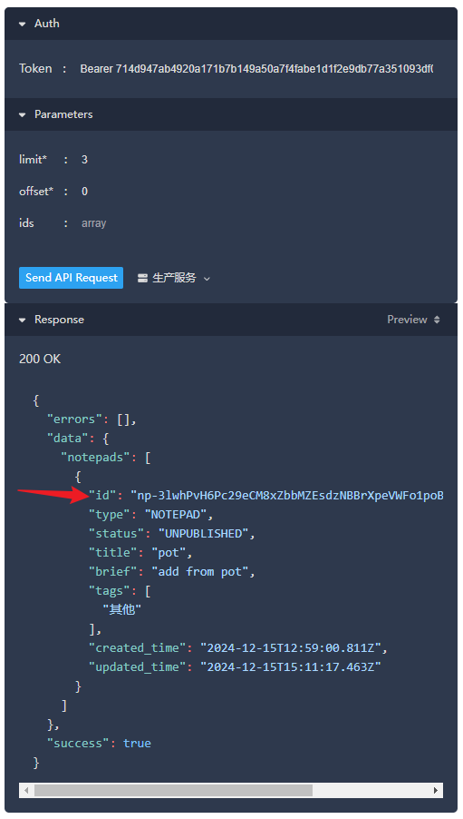

# Pot-App 墨墨云词本添加单词插件

## 使用方法

1. 下载对应平台的插件，得到 `.potext` 文件
2. 打开 Pot-偏好设置-服务设置-翻译-添加外部插件-安装外部插件
3. 选择刚刚得到的 `.potext` 文件，安装成功
4. 将插件添加到服务列表即可使用

## 获取墨墨 Token

1. **打开墨墨背单词 APP**。

2. **申请开放 API 的 Token**

   - 进入 **我的** > **更多设置** > **实验功能** > **开放 API**。
   - 按照提示申请您的 API Token。

3. **记录 Token**

   - 申请成功后，会显示您的 **Token**，请妥善保存。

## 云词本 ID 获取方法

1. **创建云词本**

   - 在墨墨背单词 APP 中，创建一个新的云词本，或使用已有的云词本。

2. **访问墨墨开放 API 文档**

   - 打开浏览器，访问[墨墨开放 API 文档](https://open.maimemo.com/document#/operations/maimemo.openapi.notepad.v1.NotepadService.ListNotepads)
   
3. **填写请求参数**

   - **Token**
     - 在页面右侧的 **Token** 输入框中输入墨墨 Token, 注意在 Token 前加上 `Bearer `：
       ```
       Bearer your_momo_token_here
       ```
   - **limit***：
     - 填写您创建的所有云词本数量，确保能获取到所有的云词本。
   - **offset***：
     - 填写 `0`。

4. **发送请求**

   - 点击 **发送** 按钮，获取您的云词本列表。

5. **获取云词本 ID**

   - 在返回的结果中，找到您想要使用的云词本。
   - `title`为词本名。
   - 复制该云词本的 `id`
  
   